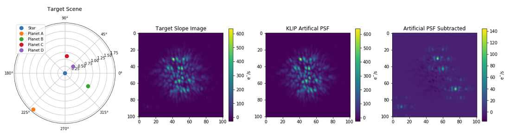

Pandeia-Coronagraphy
=====

Installation
----

It is highly recommended that you begin by installing `AstroConda <http://astroconda.readthedocs.io/en/latest/installation.html#install-astroconda>`_ (with Python 2.7 or python 3) and then follow these installation `instructions <https://jwst-docs.stsci.edu/display/JPP/JWST+ETC+Coding+Tutorial>`_ to install the Pandeia engine and the required reference files. Once Pandeia is set up, the following command will install this package:

 ``pip install git+git://github.com/spacetelescope/pandeia-coronagraphy.git``

_____

Alternatively, follow these step-by-step instructions:

1. If you don't already have Anaconda or Miniconda installed, download and install either the Python 2.7 version or the Python 3 version `here <https://conda.io/miniconda.html>`_.

2. Add the AstroConda channel to your Conda channels: 

 ``conda config --add channels http://ssb.stsci.edu/astroconda``

3. Create a conda environment with the STScI software stack:

 ``conda create -n astroconda stsci python=2.7``
 
 or
 
 ``conda create -n astroconda stsci python=3``

4. Activate this environment with ``source activate astroconda``. (NB: Conda is only compatible with a BASH shell.)

5. Install the Pandeia engine with this command: ``pip install pandeia.engine``. (You *should* already have the Pysynphot package installed at this point. If you don't, install it with ``pip install pysypnphot``. You can generate a list of installed packages with ``conda list``.)

6. Download and unzip the matching Pandeia data files from the `Pandeia pypi page <http://ssb.stsci.edu/pandeia/engine/>`_ and the PySynphot data files (ftp://archive.stsci.edu/pub/hst/pysynphot/). See `Installing PySynphot Data Files`_ for more detail on setting up the PySynphot data files.

7. Add the following lines to your ~/.bashrc file (and ``source`` it after modifying):

 .. code-block:: bash

	export pandeia_refdata=/path/to/pandeia/data/directory
	export PYSYN_CDBS=/path/to/cdbs/directory
 
8. Finally, install the pandeia-coronagraphy package:

 ``pip install git+git://github.com/spacetelescope/pandeia-coronagraphy.git``

9. (Optional, but *highly* recommended) Install `WebbPSF <https://pythonhosted.org/webbpsf/index.html>`_ with ``conda install webbpsf``. This is required only if you are interested in using higher-fidelity PSFs in your calculations; otherwise, the Pandeia engine relies on interpolations of a bundled library of precomputed PSFs. This functionality is documented `here <https://github.com/spacetelescope/pandeia-coronagraphy/blob/master/notebooks/miri_photon_noise_and_contrast.ipynb>`_ and `here <https://github.com/spacetelescope/pandeia-coronagraphy/blob/master/notebooks/nircam_small_grid_dither.ipynb>`_.

Installing PySynphot Data Files
----

The entire PySynphot data file collection is quite large, and the PySynphot package expects a particular directory structure. If you're on the STScI network, you can skip this download and point the ``PYSYN_CDBS`` environment variable to the CDBS directory on central store instead (``/grp/hst/cdbs``). Otherwise, two (hopefully) helpful tips for installing the reference files locally:

1. Rather than download every package, you may be able to get away with downloading only the Pysynphot Phoenix Models (ftp://archive.stsci.edu/pub/hst/pysynphot/synphot5.tar.gz).
2. The .tar files will unpack to a directory structure that looks something like ``grp/hst/cdbs/etc``. You'll need to consolidate the multiple structures into a single directory structure under ``cdbs``. When setting up your environment variables in Step 7 (under `Installation`_), you'll want to point to the ``cdbs`` directory directly.

Getting Started
----

Once installation is complete, take a look at the provided `Jupyter notebooks <https://github.com/kvangorkom/pandeia-coronagraphy/tree/master/notebooks>`_ for examples of constructing a scene, setting instrument properties, running the Pandeia engine, and performing some basic post-processing.

You can find a quickstart guide to using the Pandeia engine `here <https://jwst-docs.stsci.edu/display/JPP/JWST+ETC+Coding+Tutorial>`_.

Example input templates for the Pandeia engine are provided for coronagraphy `here <https://github.com/spacetelescope/pandeia-coronagraphy/tree/master/pandeia_coronagraphy/templates>`_ and for other instruments and observing modes `here <https://github.com/spacetelescope/pandeia-tutorials/tree/master/configurations/jwst>`_.
