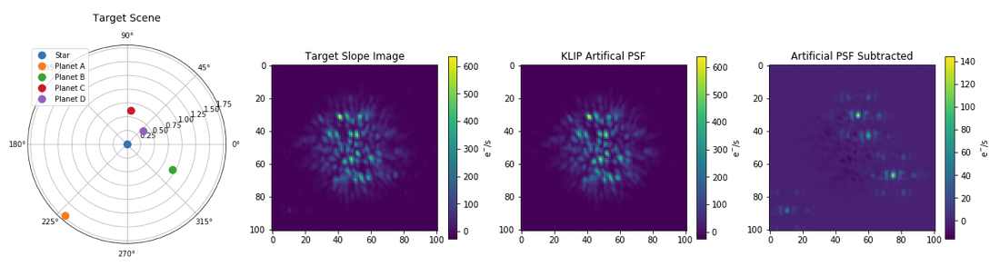

.. JWST PanCAKE Documentation documentation master file, created by
   sphinx-quickstart on Mon Jun 17 17:55:10 2019.
   You can adapt this file completely to your liking, but it should at least
   contain the root `toctree` directive.

.. raw:: html

    <h1>
<small>Documentation for the</small>
    James Webb
    Space Telescope -</small>

    Pandeia Coronagraphy
    Advanced Kit and
    Exposure Time Calculator</h1>

:py:mod:`JWST-PanCAKE` is a Python package for simulating realistic coronagraphic observations for NASA's JWST observatory. JWST-PanCAKE (known henceforth as PanCAKE) is an extention to STScI's
`Pandeia <http://www.stsci.edu/jwst/science-planning/proposal-planning-toolbox/exposure-time-calculator>`_---the
Exposure Time Calculator (ETC) system developed for JWST. In addition to performing exposure time calculations, the PanCAKE toolkit provides functionality to circumvent the use of
Pandeia's precomputed PSF library by generating Point spread functions (PSFs) on-the-fly with WebbPSF; introduce mis-registration of the PSF reference star; experiment with small grid dithers (SGDs);
iterate over instrument configurations to optimize observation parameters and produce contrast curves.

All PSFs are generated via WebbPSF (https://webbpsf.readthedocs.io) to reproduce realistic JWST images and spectra.

**Authors:** Bryony Nickson

**Contributors:** JWST-PanCAKE has been developed by members of the coronagraphs working group (CWG) at the Space Telescope Science Institute (STScI).

**Questions?**
Please contact help@stsci.edu with "JWST-PanCAKE Question" in the subject line.

-----------------------------------

.. _getting-started:

Getting Started
****************

* :ref:`install`
* :ref:`tutorials`

.. admonition:: STScI PanCAKE Jupyter Notebooks

   This documentation is complemented by a collection of `Jupyter Notebook format tutorials <https://nbviewer.jupyter.org/github/spacetelescope/pandeia-coronagraphy/tree/master/notebooks/>`_. Downloading and running these notebooks is a great way to get started with PanCAKE.

**Questions?** For help using or installing jwst-pancake, please contact the STScI Help Desk at help@stsci.edu and include "JWST-PanCAKE" in the subject line.

-----------

.. _user-docs:

User Documentation
******************

.. _project-details:

Project details
***************

* :ref:`authors`
* :ref:`cite`
* :ref:`disclaimer`

------------

* :ref:`genindex`
* :ref:`modindex`
* :ref:`search`
