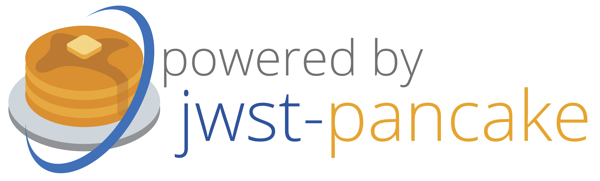

.. image:: PANCAKE-logo.png
    :scale: 1.5%
    :align: left
    :alt: jwst-pancake

.. _cite:

################################
Acknowledging or Citing PanCAKE
################################

Publications
**************
If you utilize PanCAKE for work presented in a publication (whether directly, or as a dependency to another package),
we ask that you please cite PanCAKE by including the following LaTeX/BibTex statement in the acknowledgment section of your paper:

    This research made use of PanCAKE,\footnote{http://www.jwst-pancake.org} a Python package developed by members of the Space Telescope Science Institute (STScI)
    for planning coronagraphic observations with JWST.

As an alternative, the BibTeX record recommended for a given version of Astropy is available from the Python package itself:

.. code:: Python

    jwst-pancake.__citation__

-------------

In Presentations
****************

If you are providing a presentation or talk featuring work that makes use of PanCAKE, we kindly ask that you acknowledge PanCAKE
using this logo on your title slide:

--------

In Projects
*************

If you are using PanCAKE as part of a code project (e.g., affiliated packages),
a useful way to acknowledge your use of PanCAKE is with a badge in your README. We suggest this badge:

.. raw:: html

    

---------
